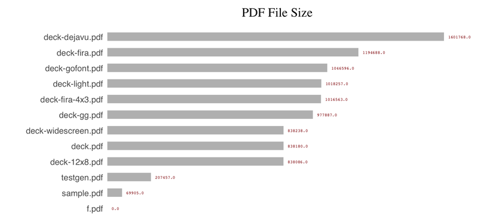

# bchart - make barcharts in the deck format #

bchart reads data from the standard input file, generating deck markup to standard output.
 
Input is a tab-separated list of text,data pairs
where text is an arbitrary string, and data is intepreted as a floating point value.
A line beginning with "#" is parsed as a title, with the title text beginning after the "#".

For example:

	# PDF File Sizes
	casino.pdf	410907
	countdown.pdf	157784
	deck-12x8.pdf	837831
	deck-dejavu.pdf	1601595
	deck-fira-4x3.pdf	1196167
	deck-fira.pdf	1195517
	deck-gg.pdf	978688
	deck-gofont.pdf	1044627

bchart is useful in pipelines: (generate a list of filenames and sizes, sort and label, then make a PDF)

	ls -l *.pdf | awk '{ print $NF "\t" $5 }' | 
	(echo "# PDF File Size"; sort -nr -k2) | 
	bchart -textsize 1.5 > f.xml && pdfdeck f.xml

 The command line options are:

	-color barcolor (default "rgb(175,175,175)")
	-datafmt data format (default "%.1f")
	-dmin data minimum instead of zero
	-dot draw a line and dot instead of a solid bar
	-left n - left margin (default 20)
	-textsize n - text size (default 1.2)
	-top n  - top of the chart (default 90)
