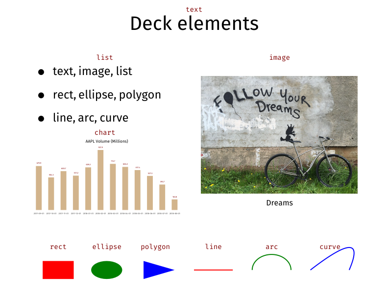

# decksh: a little language for deck markup

```decksh``` is a domain-specific language (DSL) for generating ```deck``` markup.

# Running the command

	$ decksh                   # input from stdin, output to stdout
	$ decksh -o foo.xml        # input from stdin, output to foo.xml
	$ decksh foo.sh            # input from foo.sh output to stdout
	$ decksh -o foo.xml foo.sh # input from foo.sh output to foo.xml
	
Typically, ```decksh``` acts as the head of a rendering pipeline:

	$ decksh text.sh | pdf -pagesize 1200,900 

## Example input

This deck script

	// example deck
	deck begin
		canvas 1200 900
		slide begin "white" "black"
			ctext "Deck elements" 50 90 5
			cimage "follow.jpg" "Dreams" 70 60 640 480 50 "https://budnitzbicycles.com"

			blist 10 70 3
				li "text, image, list"
				li "rect, ellipse, polygon"
				li "line, arc, curve"
			elist

			rect    15 20 8 6              "rgb(127,0,0)"
			ellipse 27.5 20 8 6            "rgb(0,127,0)"
			polygon "37 37 45" "17 23 20"  "rgb(0,0,127)"
			line    50 20 60 20 0.25       "rgb(127,0,0)"
			arc     70 20 10 8 0 180 0.25  "rgb(0,127,0)"
			curve   80 20 95 30 90 20 0.25 "rgb(0,0,127)"
			ctext "rect"     15 15 1
			ctext "ellipse"  27.5 15 1
			ctext "polycon"  40 15 1
			ctext "line"     55 15 1
			ctext "arc"      70 15 1
			ctext "curve"    85 15 1
			dchart -left=10 -right=45 -top=50 -bottom=30 -fulldeck=f -textsize=0.7 -color=tan  -barwidth=1.5 AAPL.d 
		slide end
	deck end

	
Produces:


	
Text, color and caption arguments follow Go convetions (surrounded by double quotes).
Colors are in rgb format ("rgb(n,n,n)"), or SVG color names.

Coordinates, dimensions and opacities are floating point numbers ranging from from 0-100 
(they represent percentages on the canvas and percent opaque).

Canvas size and image dimensions are in pixels.

## Structure

	deck begin
	deck end
	slide begin [bgcolor] [fgcolor]
	slide end
	canvas w h
	
## Text

	text  "text" x y size [font] [color] [opacity]
	ctext "text" x y size [font] [color] [opacity]
	etext "text" x y size [font] [color] [opacity]
	
## Images

	image  "file" x y width height [scale] [link]
	cimage "file" "caption" x y width height [scale] [link]
	
## Lists
	
	list   x y size [font] [color] [opacity]
	blist  x y size [font] [color] [opacity]
	nlist  x y size [font] [color] [opacity]
	li "text"
	elist
	
## Graphics

	rect    x y w h [color] [opacity]
	ellipse x y w h [color] [opacity]

	square  x y w [color] [opacity]
	circle  x y w [color] [opacity]
	
	polygon "xcoords" "ycoords" [color] [opacity]
	line    x1 y1 x2 y2 [size] [color] [opacity]
	arc     x y w h a1 a2 [size] [color] [opacity]
	curve   x1 y1 x2 y2 x3 y3 [size] [color] [opacity]

## Charts

	dchart [args]

