# lchart - charts for deck

```lchart``` generates deck markup for  bar, line, dot, and volume charts, reading data from the standard input or specified files. Unless specified otherwise, each input source generates a slide in the deck.

The input data format a tab-separated list of ```label,data``` pairs where label is an arbitrary string, 
and data is intepreted as a floating point value. A line beginning with "#" is parsed as a title, 
with the title text beginning after the "#".  If a third column is present, it serves as an annotation.

Here is an example input data file:

	# GOOG Stock Volume (Millions of Shares)
	2017-01-01	33.1916
	2017-02-01	25.6825
	2017-03-01	33.8351	Peak
	2017-04-01	25.1619
	2017-05-01	32.1801
	

Typically ```lchart``` generates input for deck clients like ```pdfdeck```, or ```pdi``` (shell script for pdfdeck which reads
deck markup on the standard input and produces PDF on the standard output).

    $ lchart foo.d bar.d baz.d > fbb.xml && pdfdeck fbb.xml && open fbb.pdf
	$ lchart -min=0 -max=700 -datafmt %0.2f -connect -bar=f -vol -dot [A-Z]*.d | pdi > allvol.pdf
    $ ls -lS | awk 'BEGIN {print "# File Size"} NR > 1 {print $NF "\t" $5}' | lchart -layout h | pdi > fs.pdf

With no options, ```lchart``` makes a bar graph with yaxis labels, showing data values and every data label.

The plot is positioned and scaled on the deck canvas with the 
```-top```, ```-bottom```, ```-left```, and ```-right``` flags. 
These flag values represent percentages on the deck canvas.

The  ```-bar```, ```-line```, ```-dot```, ```-grid```, ```-title``` ```-val```, ```-vol```, and ```-yaxis``` 
flags toggle the visibility of plot components.  


The command line options are:

	-dmim        data minimum (default false, min=0)
	-min         set the minimum value
	-max         set the maximum value

	-layout      chart layout ("h" for horizontal bar chart)
	-bar         show bars (default true)
	-line        show line chart (default false)
	-dot         show dot plot (default false)
	-grid        show gridlines on the y axis (default false)
	-val         show values (default true)
	-valpos      value position (t=top, b=bottom, m=middle) (default "t")
	-vol         show volume plot (default false)
	-yaxis       show a y axis (default false)
	-standalone  only generate internal markup (default false)
	-title       show title (default true)
	-chartitle   specify the title (overiding title in the data)
	
	-top         top of the plot (default 80)
	-bottom      bottom of the plot (default 30)
	-left        left margin (default 20)
	-right       right margin (default 80)
	
	-barwidth    barwidth (default computed from the number of data points)
	-ls          linespacing (default 2.4)
	-textsize    text size (default 1.5)
	-xlabel      x axis label interval (default 1, 0 to supress all labels)
	-color       data color (default "lightsteelblue")
	-vcolor      value color (default "rgb(127,0,0)")
	-datafmt     data format for values (default "%.1f")


## Usage examples

Given this input in the file ```AAPL.d```

	# AAPL Volume
	2017-01-01	563.122
	2017-02-01	574.969
	2017-03-01	561.628
	2017-04-01	373.304
	2017-05-01	653.755
	2017-06-01	684.178
	2017-07-01	421.992
	2017-08-01	661.069
	2017-09-01	679.879
	2017-10-01	504.291
	2017-11-01	600.663
	2017-12-01	417.354

here are some variations.

	$ lchart AAPL.d

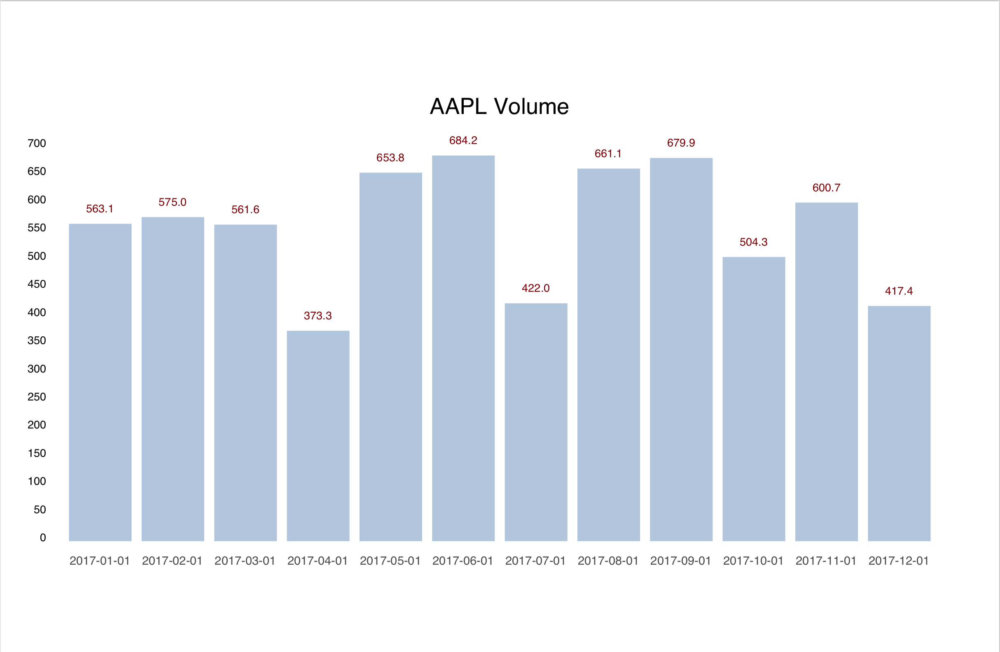

	$ lchart -xlabel=2 -left 30 -right 70 -top 70 -bottom 40 -yaxis=f

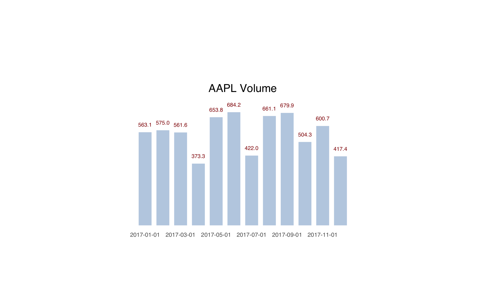

	$ lchart -color gray AAPL.d # change the "data color"

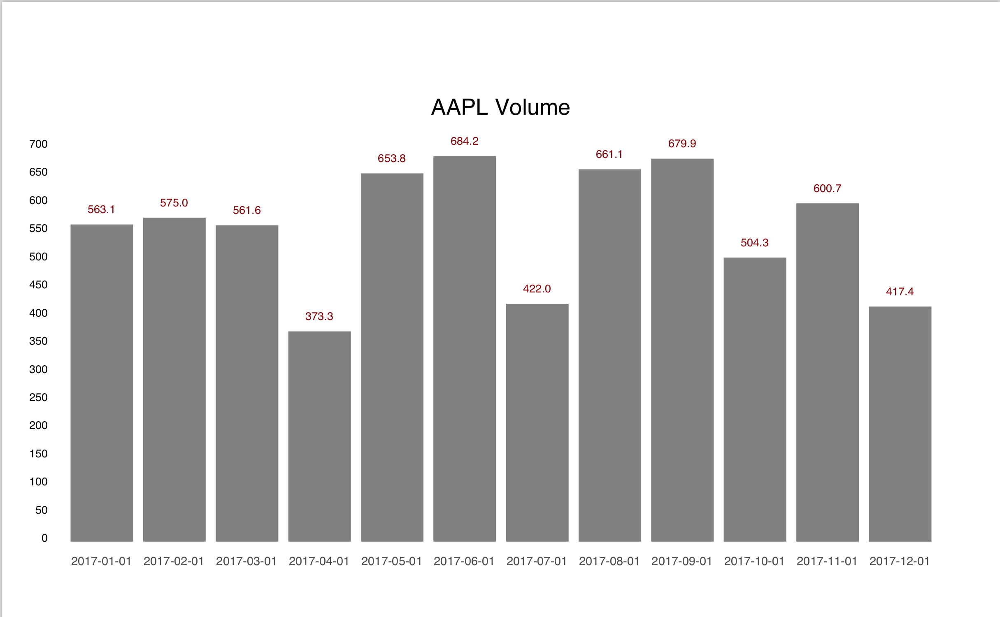

	$ lchart -grid AAPL.d # add a y axis grid

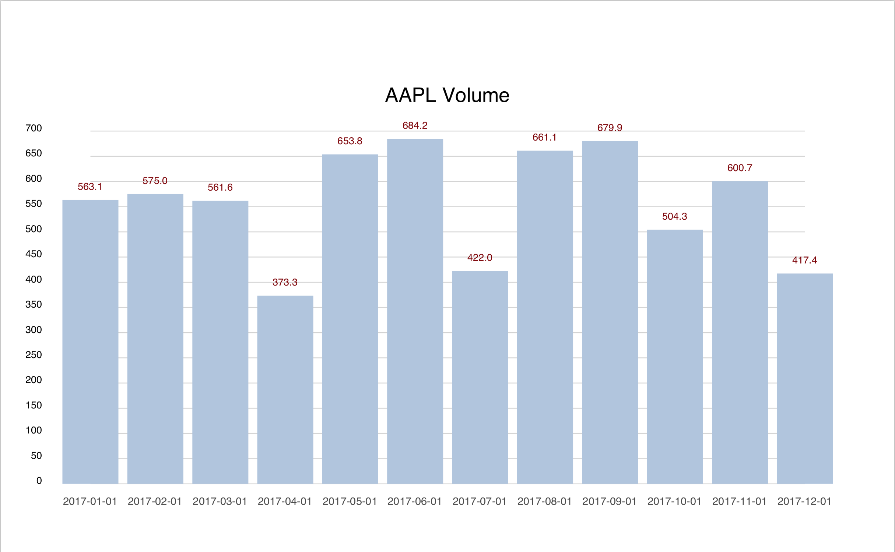

	$ lchart -grid -barwidth=1 AAPL.d # adjust the bar width

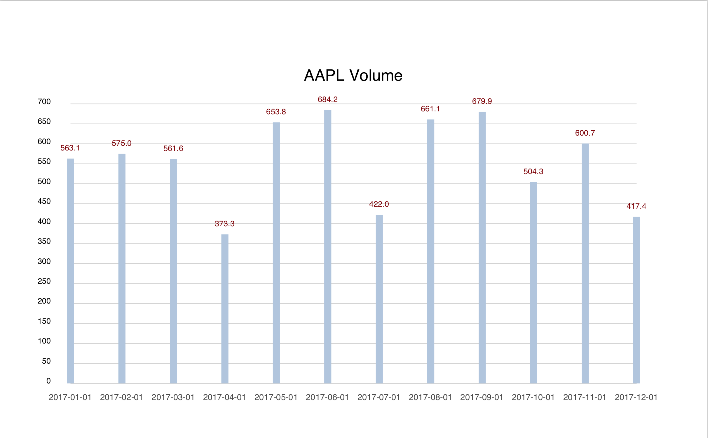

	$ lchart -bar=f -dot AAPL.d # no bars, dot plot

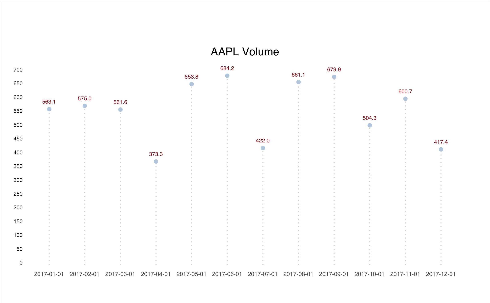

	$ lchart -bar=f -vol AAPL.d # no bars, volume plot


	$ lchart lchart -datafmt %0.2f -bar=f -dot  -connect  

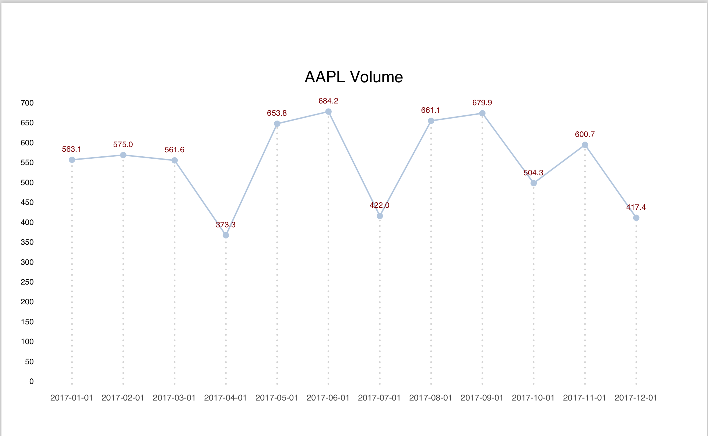

	$ lchart -bar=f -connect AAPL.d # line chart

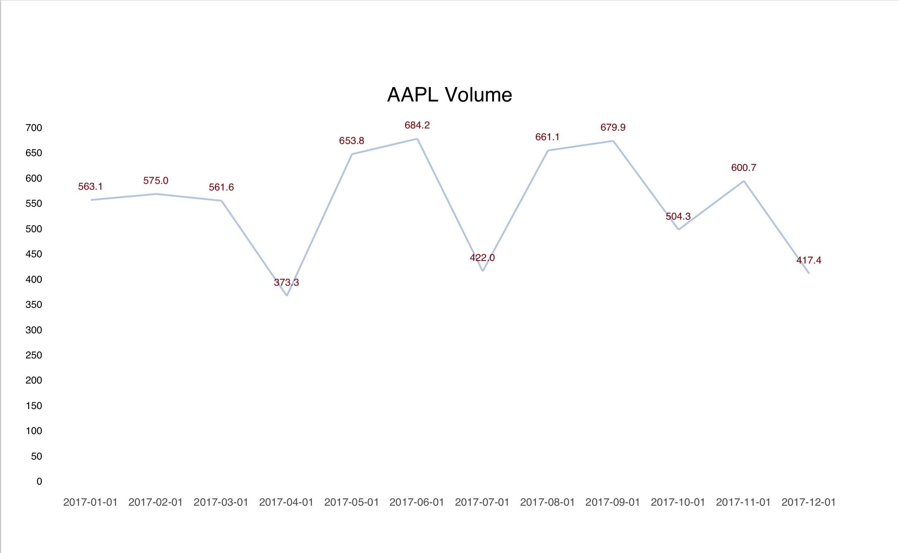

	$ lchart -bar=f -connect -yaxis=f -val=f AAPL.d # only show line and x axis

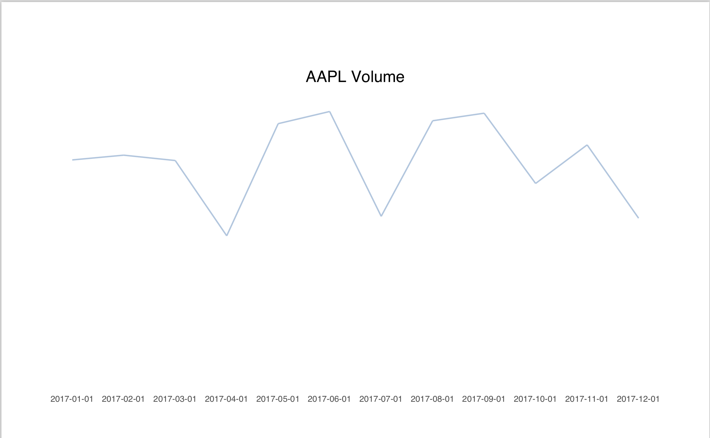

	$ lchart -bar=f -connect -vol -dot # combine line, volume, and dot

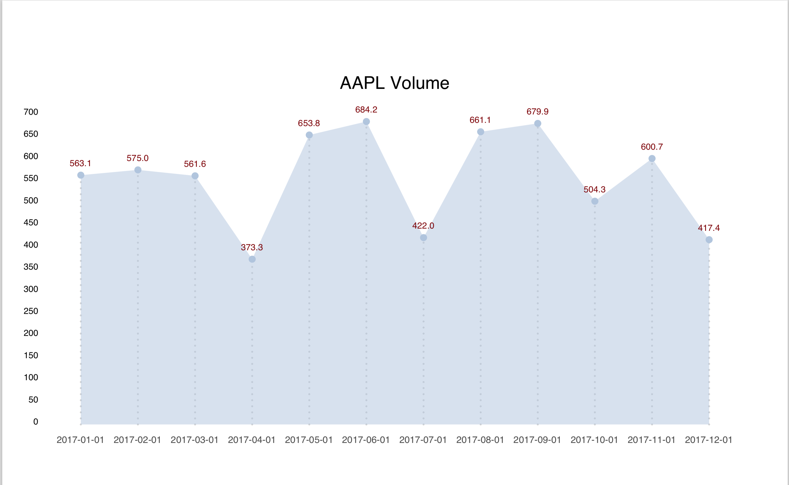

	$ lchart -bar=f -connect -vol -dot -yaxis=f # as above, removing the y-axis

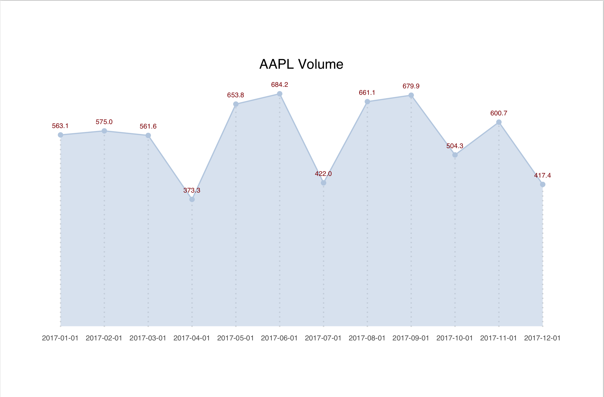

	$ lchart -bar=f -connect -vol -dot -grid 


	$ lchart -layout=h AAPL.d

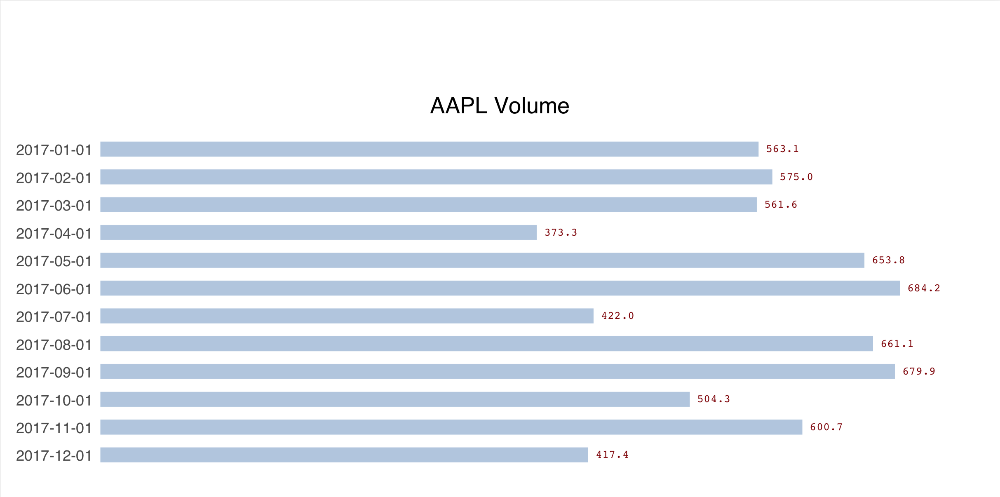

	$ sort -k2 -nr pdf.d | lchart -left 20 -layout h -datafmt %0.f

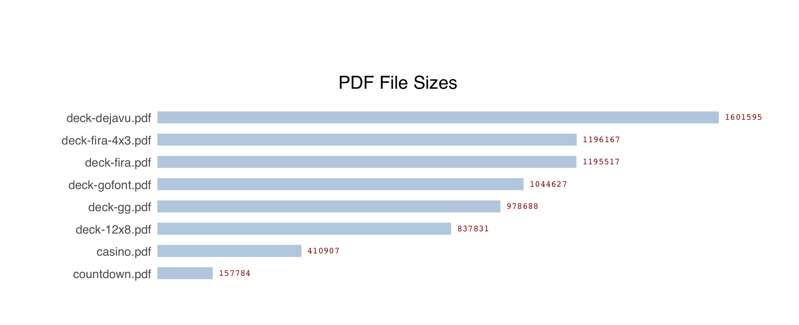


